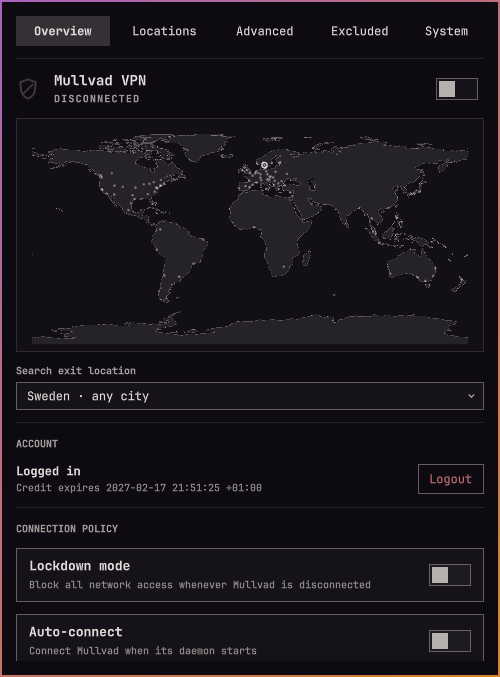

# OmaMullvad



Mullvad VPN controls for the Omarchy Quattro bar.

- Connect and disconnect from the bar or panel
- Search relays and choose a specific server
- Save up to nine favourite locations
- Filter by provider, ownership, and IP version
- Configure DNS, anti-censorship, LAN sharing, and lockdown mode
- Launch apps outside the VPN (the Excluded tab lists your 10 most recent; search for the rest)
- Excluded lists each launched app with its process count
- View Mullvad relay cities on a world map

This plugin follows the active Omarchy theme and works with the stock bar and Shibumi.

## Install

OmaMullvad is on the Omarchy plugin marketplace (`omarchy plugin add
https://github.com/kallupx/oma-mullvad.git --enable`); this repository is a
contribution fork — changes are offered upstream as pull requests.

To develop against this fork directly, install it as a manual clone into
the plugins folder instead:

```bash
git clone <this-repo> ~/.config/omarchy/plugins/io.github.kallupx.oma-mullvad
```

Then enable and load it:

```bash
omarchy-shell shell rescanPlugins   # let the running shell notice the new folder
omarchy plugin enable io.github.kallupx.oma-mullvad --section right
omarchy restart shell
```

Requires Mullvad VPN 2026.4 with the daemon running. Install
[`mullvad-vpn`](https://archlinux.org/packages/extra/x86_64/mullvad-vpn/)
from the Arch `extra` repository (no AUR needed) — when the CLI isn't found,
the panel's Overview page offers an
"Install Mullvad VPN" button that installs the package and enables the
`mullvad-daemon` service for you, the same way Omarchy's own menu installs
services like NordVPN or Tailscale: a floating terminal opens, asks for
your sudo password, and the panel picks up the change on its own once it
finishes.

## Controls

- Left-click: open the panel
- Right-click: connect or disconnect
- Middle-click: refresh

The panel has Overview, Locations, Advanced, Excluded Apps, and System pages (keys 1–5). It is fully keyboard-accessible.

## Hotkeys

This plugin does not add keybindings automatically. Example `~/.config/hypr/bindings.lua` entries:

```lua
o.bind("SUPER + SHIFT + V", "Toggle Mullvad", "omarchy-shell io.github.kallupx.oma-mullvad toggleTunnel")
o.bind("SUPER + ALT + V", "Next Mullvad favourite", "omarchy-shell io.github.kallupx.oma-mullvad nextFavorite")
o.bind("SUPER + SHIFT + ALT + V", "Mullvad panel", "omarchy-shell io.github.kallupx.oma-mullvad toggle")
```

## Uninstall

```bash
omarchy plugin remove io.github.kallupx.oma-mullvad
```

## Privacy

Account numbers are sent to `mullvad account login` over standard input and are never stored. This plugin stores only favourites, recent locations, and recently launched excluded apps; Mullvad remains responsible for VPN settings. See [`docs/threat-model.md`](docs/threat-model.md) for the full threat model.

## Verify

```bash
bash test/all
omarchy plugin validate .
```

`test/all` runs the Node unit tests (`Model.js`, a QML Text-sink audit),
the packaged-scripts suite, `test/cli-contract.mjs` (read-only against the
real Mullvad CLI), and `test/probe/run` — a deterministic mock-CLI probe
suite (`ok`/`hang`/`flood`/`fail` modes) that exercises `Service.qml`'s
Process pipeline end to end against a shadowed `mullvad` binary, never the
real daemon. See `docs/developers.md` "Process contract" for what every
`mullvad` invocation actually is: a direct Quickshell `Process` child, no
shell wrapper anywhere on the CLI path.

## Credits

Author: kallupx. Contributions (2026): HalmyLyseas.

Forked from [kallupx/oma-mullvad](https://github.com/kallupx/oma-mullvad), the
original OmaMullvad plugin. This fork keeps its upstream history (`upstream`
remote) and intends to upstream fixes back via PR where they apply.

## License

MIT © 2026 kallupx; portions © 2026 HalmyLyseas

The map uses public-domain [Natural Earth](https://www.naturalearthdata.com/) data. Relay locations come from the Mullvad CLI.
