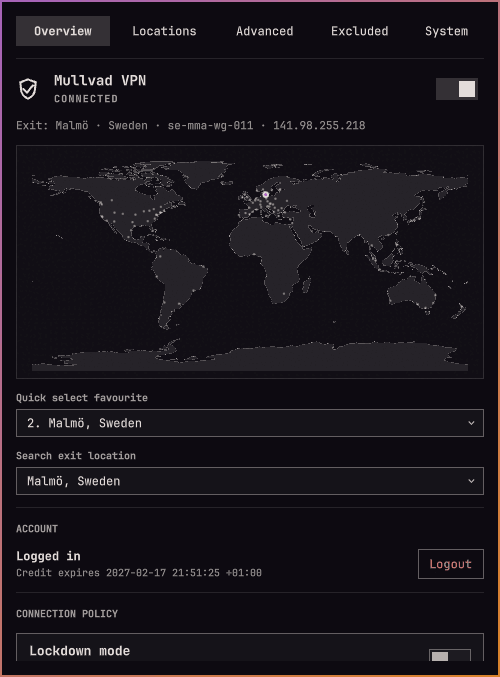

# OmaMullvad



Mullvad VPN controls for the Omarchy Quattro bar.

- Connect and disconnect from the bar or panel
- Search relays and choose a specific server
- Save up to nine favourite locations
- Filter by provider, ownership, and IP version
- Configure DNS, anti-censorship, LAN sharing, and lockdown mode
- Discover installed applications and launch them outside the VPN
- Group related excluded processes by launched application
- View Mullvad relay cities on a world map
- Inspect bounded, read-only CLI, daemon, package, and update-check diagnostics

OmaMullvad supports the Omarchy 4.0.3+ stock bar. Replacement bars that do not expose the plugin's scoped service show unavailable controls rather than attempting access to host internals.

## Install

```bash
omarchy plugin add https://github.com/HalmyLyseas/oma-mullvad.git --enable
```

OmaMullvad targets Mullvad VPN 2026.4. Install and enable Mullvad VPN separately before using the controls.

## Upgrading from the upstream identity

Version `1.5-rc` uses the distinct plugin ID `halmylyseas.oma-mullvad`. It does not automatically migrate an installation of `io.github.kallupx.oma-mullvad`. Back up `~/.config/omarchy/shell.json` before switching, preserve the old widget's favourites, recent items and refresh interval, and disable the old widget before enabling this fork. Custom IPC keybindings must use the new ID.

## Controls

- Left-click: open the panel
- Right-click: connect or disconnect
- Middle-click: refresh

The panel has Overview, Locations, Advanced, Excluded Apps, and System pages. It is keyboard-accessible. System remains available when the Mullvad CLI or daemon is unavailable and offers only a read-only update check; installation and package or service changes remain separate administrator actions.

## Known limitations

Tailscale's netfilter rules can interfere with Mullvad's Linux split-tunnelling marks. On affected systems, including the combination of Tailscale 1.102.3 and Mullvad 2026.4, an application appears in the excluded-process list but public connections time out. This is tracked upstream in [tailscale/tailscale#19787](https://github.com/tailscale/tailscale/issues/19787).

Do not disable Tailscale netfilter without providing equivalent firewall and tailnet-routing rules. The plugin does not alter Tailscale or system firewall configuration.

## Hotkeys

OmaMullvad does not add keybindings automatically. Example `~/.config/hypr/bindings.lua` entries:

```lua
o.bind("SUPER + SHIFT + V", "Toggle Mullvad", "omarchy-shell halmylyseas.oma-mullvad toggleTunnel")
o.bind("SUPER + ALT + V", "Next Mullvad favourite", "omarchy-shell halmylyseas.oma-mullvad nextFavorite")
o.bind("SUPER + SHIFT + ALT + V", "OmaMullvad panel", "omarchy-shell halmylyseas.oma-mullvad toggle")
```

## Uninstall

```bash
omarchy plugin remove halmylyseas.oma-mullvad
```

## Privacy

Account numbers are sent to `mullvad account login` over standard input and are never stored. OmaMullvad stores only favourite locations, recent locations, and recent excluded desktop IDs. Mullvad remains responsible for VPN settings.

## Verify

Run the complete non-disruptive local gate:

```bash
bash tests/ci-local
```

Use `bash tests/ci-local --no-cage` only as a fallback for an existing live session when Cage cannot be used.

The CLI contract and every VPN-changing operation run against inert test-local mocks; automated suites never invoke the live Mullvad CLI.

## License

Maintained by [HalmyLyseas](https://github.com/HalmyLyseas), based on [kallupx/oma-mullvad](https://github.com/kallupx/oma-mullvad).

MIT © 2026 kallupx. Original copyright and license are retained.

The map uses public-domain [Natural Earth](https://www.naturalearthdata.com/) data. Relay locations come from the Mullvad CLI.
